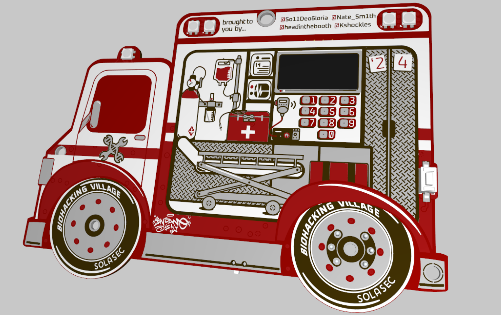
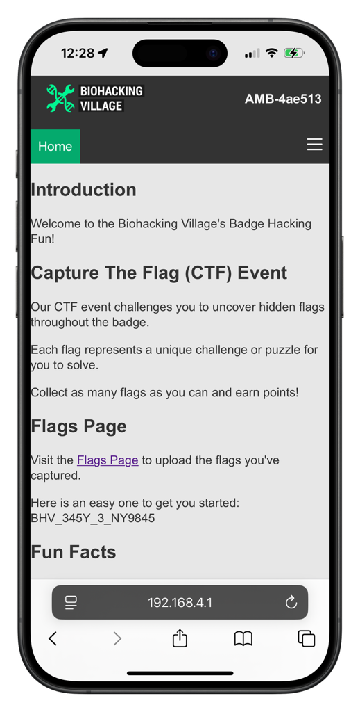

This Repo is for the 2024 Biohacking Village Badge. This guide will help you set up your development environment, connect your badge, and start hacking. Keep an Eye out, as more details will be slowly added to the project during DEF CON. 

## Table of Contents

- [Table of Contents](#table-of-contents)
- [Introduction](#introduction)
- [Badge Use](#badge-use)
  - [Reading your BAC](#reading-your-bac)
    - [Connect Wirelessly to the Badge](#connect-wirelessly-to-the-badge)
    - [Getting your Password](#getting-your-password)
- [Hardware Information](#hardware-information)
- [Interrating with the badges firmware.](#interrating-with-the-badges-firmware)
  - [Software](#software)
  - [Tools](#tools)
- [Setting Up the Development (or RE) Environment](#setting-up-the-development-or-re-environment)
- [Connecting the Badge](#connecting-the-badge)
  - [Linux / Unix / MacOS](#linux--unix--macos)
  - [Windows](#windows)
- [Contributing](#contributing)
- [License](#license)
- [Contact](#contact)

## Introduction

This project contains the firmware and tools needed to develop and customize your DEFCON badge. Whether you are new to firmware development or an experienced hacker, this guide will help you get started.

## Badge Use

This years badge will allow you (in)accurately measure your BAC.  This solution is only for fun [TODO] Pull out standard disclaimer….  

> [!WARNING]
> **Please drink responsibly. This BAC should not be relied upon to give you an accurate BAC reading or for any medical purposes.**
>
>  **DO NOT drink and operate any dangerous machinery (or software)**
>
> **DO drink and hack this badge.** *That being said, no alcohol is required to solve any flags* 

### Reading your BAC

After the badge turns on, simply tap the button (*theres only one*), and follow the instructions, the badge will warm the sensor first, once the light turns green. Slowly blow into the disposable mouthpiece . 

> [!TIP]
> The MQ-3 Sensor used to detect alcohol is heavily influenced by the environment, including ambient temperature and humidity.  You may additionally find that the sensor needs to warm for a while to burn off any residual alcohol on the sensing elsment. You can burn off the sensor to recalibrate it by charging the device via usb. The sensor will heat up for 10 minutes then turn off, so the badge can safely left on the charger. 


#### Connect Wirelessly to the Badge



Each badge will advertise its own WiFi access point, the SSID will match your Unique badge name (AMB-xxxxxx). Once connected you can access the badge's Web UI @ 192.168.4.1. 

#### Getting your Password


Each badge has a unique 8 character password.  You can find this password by holding the button for 1 sec and releasing. In addition to the password, the badge will additionally generate a QR Code.  You can scan this QR code to quickly connect to your Badge without having to enter any passwords.
(Little Tip, some characters, (such as ‘u’ and ‘v’ look very similar so if your password does not work, make sure you entered the right characters)

>[!TIP]
> Some characters, such as `u` and `v`, `1` and `l` look very similar so if your password does not work, consider similar characters.


## Hardware Information

If you’re looking for more information on the badge hardware, the project is published on [Altium 365](https://365.altium.com/files/9CA5ACBF-76BB-4CD4-BA4E-9E25169BB9EB?openedFrom=files&variant=[No+Variations]). You can find scematics, 3d models, gerbers, etc. 

> [!CAUTION]
> This badge has multiple power rails, the Raspberry Pi Pico W IO pins are only protected up to VDD(3.3V) if probing the device **DO NOT apply more than 3.3V to any vias, connections, test pads etc.  It could damage your badge.**

## Interrating with the badges firmware. 

Before you begin, ensure you have the following:

- A DEFCON badge,  Come visit us at BHV for more details!
- A computer, Linux, MacOS, Windows, Its all good. 
- A micro-usb cable

### Software

- [Python 3.x](https://www.python.org/downloads/)
- [pip](https://pip.pypa.io/en/stable/installation/)
- [Git](https://git-scm.com/book/en/v2/Getting-Started-Installing-Git)
  

### Tools

- [Visual Studio Code](https://code.visualstudio.com/)
- [MicroPico Extension](https://github.com/paulober/MicroPico)

## Setting Up the Development (or RE) Environment

1. **Install Python and pip** (If you need to load new firmware)
  - Download and install Python 3.x from the [official website](https://www.python.org/downloads/).  If you already have python, I do recommend setting up virtual environments for your python projects,  check out:
  - https://github.com/pyenv/pyenv-virtualenv
  - Verify the installation by running:
    ```bash
    python --version
    pip --version
    ```

2. **Install Git**
  - Download and install Git from the [official website](https://git-scm.com/book/en/v2/Getting-Started-Installing-Git). 
  - Clone this repo
    

3. **Install Visual Studio Code**
   
  - Download and install [Visual Studio Code](https://code.visualstudio.com/).
  - Add the [MicroPico Extension](https://github.com/paulober/MicroPico)  and pre-reqs. 
  - Open Visual Studio Code and install the MicroPico extension from the marketplace.
    - Here’s a [guide](https://randomnerdtutorials.com/raspberry-pi-pico-vs-code-micropython/). 

4. ** Firmware Folder**


## Connecting the Badge

To load firmware to the badge, we typically use rshell and rsync files to the badge, generally, you can sync files from the `/firmware` folder. This will be shared sometime this weekend. Once we make changes, we recommend converting the .py files into frozon byte-code (.mpy files) as they limit preprocessing.

If updating all the firmware you can leverage the script in `/tools/optimize.py` to generate frozen bytecode rather than placing .py files on the badge.  This helps with memory usage and general execution speed. You will have to modify the script to work on your machine and you may need to compile/install the mpy-cross binary for your machine.  

### Linux / Unix / MacOS

1. **Install rshell**
     - Open a terminal and run the following command to install rshell:
       ```bash
       pip install rshell
       ```
2. **Navigate to `/build` or `firmware`**
     - Open a terminal and run the following command to install rshell:
        ```bash
        # released / optimized code
        cd build/

        # un-optimized python scripts (require more RAM to interpret)
        cd firmware/
        ```
3. **Connect the Badge to Your Computer**
     - Use a USB cable to connect your DEFCON badge to your computer.
     - The screen will indicate that its charging. 

4. **Verify the Connection**
     - Open a terminal and list the connected devices:
       ```bash
       rshell -p /dev/ttyUSB0
       ```
     - Replace `/dev/ttyUSB0` with the appropriate device path for your system.
     - If successful, you sould be able to navigate to /pyboard/ to find files loaded on the device. 
5. **Make Your Changes**
    - Modify the firmware code as needed.
6. **Upload the Firmware**
     - Open a terminal and use rshell to upload the firmware.  Typically the device will be automatically discovered. But in the off chance you have to specify, point directly to the device, such as /dev/ttyUSB0. 
    ```bash

    rshell -p /dev/ttyUSB0 # May need to use sudo 

    cp main.py /pyboard # if you need to copy a single file

    # sync the entire firmware folder...

    rsync -a . /pyboard/
    ```
---
### Windows

To be honest, the easiest solution is to use **VSCode** and **MicroPico** if your using Windows 10/11. 

1. **Open `/build` or `firmware`** in **VSCode**

2. **Follow the guide provided above ^**


  - Open Device Manager and find the COM port assigned to your DEFCON badge.
  - Open PuTTY and set the connection type to "Serial".
  - Enter the COM port (e.g., `COM3`) and set the speed to `115200`.
  - Click "Open" to start the serial communication with your badge.


## Contributing

We welcome contributions from the community! If you would like to contribute, please follow these steps:

1. **Fork the repository.**
2. **Create a new branch:**
  ```bash
  git checkout -b feature/your-feature-name
  ```
3. **Make your changes and commit them:**
  ```bash
  git commit -m "Add your commit message"
  ```
4. **Push to the branch:**
  ```bash
  git push origin feature/your-feature-name
  ```
5. **Open a pull request on GitHub.**  We’ll be keep an eye out for any pull requests!

## License

This project is licensed under the MIT License.

## Contact

If you have any questions or need further assistance, feel free to open an issue on GitHub or reach out to any of the contributors!